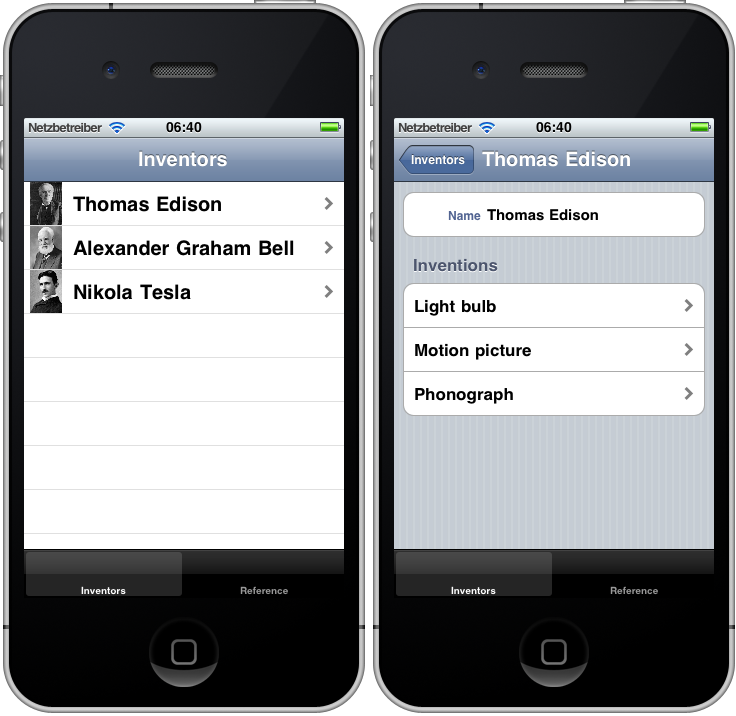
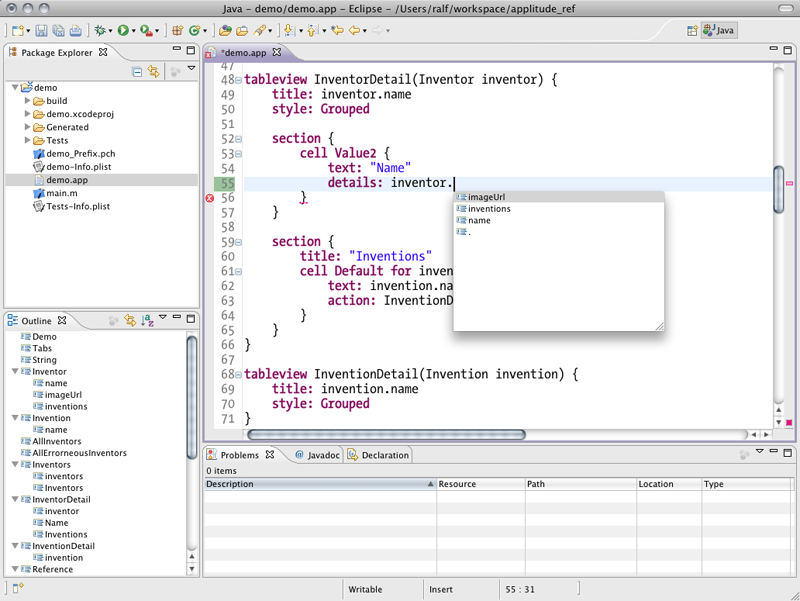

[Source](https://github.com/ralfebert/iApplause/) |
[Issues](http://ralfebert.lighthouseapp.com/projects/67904-iapplause/tickets) |
[Downloads](#downloads)

# iApplause

iApplause is a runtime framework accompanied by a DSL for developing data-centric iPhone applications. It is an iPhone-only version of the [Applause](http://code.google.com/p/applause/) Xtext DSL, extended and very much customized to my own needs.

## Overview

iApplause provides a domain specific language to describe iPhone applications, esp. the boring parts which are manually coded over and over again, in a crisp and precise way. For example, this application loads data from a URL, parses a [JSON document](https://github.com/ralfebert/iApplause/blob/gh-pages/demo/devices.json) and shows it using generated `UITableViewController` classes:

This application can be generated from [`demo.applause`](https://github.com/ralfebert/iApplause/blob/master/examples/demo/demo.applause):

	application Demo {
		view:Tabs()
	}

	type String mapsTo "NSString"

	entity Speaker {
		String speaker
		String speakerUri
	}

	entity Presentation {
		String title
		Speaker[] speakers
	}

	contentprovider AllPresentations
		returns Presentation[]
		fetches JSON from "http://cfp.devoxx.com/rest/v1/events/1/presentations"
		selects ""

	tabview Tabs {
		tab {
			title: "Schedule"
			view: Schedule()
		}
	}

	tableview Schedule {
		Presentation[] allPresentations = AllPresentations()

		title: "Schedule"
		section {
			cell Default foreach allPresentations as presentation {
				text: presentation.title
				accessory: Link
				action: PresentationDetails(presentation)
			}
		}
	}

	tableview PresentationDetails(Presentation presentation) {
		title: presentation.title
		style: Grouped

		section {
			title:"Speakers"
			cell Default foreach presentation.speakers as speaker {
				text: speaker.speaker
			}
		}
	}

iApplause is based on the marvelous [Xtext language development framework](http://www.eclipse.org/Xtext/), and as such, it comes with an Eclipse IDE plug-in:

And there is a code generator which generates iPhone applications from such DSL documents. The generated code is kept small and tidied up by making use of runtime components wherever possible. Have a look at [examples/demo/Generated](https://github.com/ralfebert/iApplause/tree/master/examples/demo/Generated) to see the generated code for `demo.applause`.

## Words of warning

The project currently is very much work in progress and therefore not very well documented; you will find loose ends and corners. You'll only get something out of it if you're seriously into Xtext DSLs and iPhone development with Objective C.

It works great for my own projects and I'm standing on the shoulders of giants here; I would never have taken that road without the Xtext project and the Applause code being open source; both very much spurred my interest in using DSL languages for my day-to-day development work. I'm making my own enhancements open source to ease collaboration with other developers on the same road.

## Getting started

I recommend learning about Xtext first, for example by reading the [Xtext Getting started documentation](http://www.eclipse.org/Xtext/documentation/).

I wrote a tutorial for the original Applause project which shows [how to install everything and create a project from scratch](http://www.ralfebert.de/blog/xtext/applause_new_app/). Almost everything still holds true for iApplause.

There also is a working example project at [`examples/demo/`](https://github.com/ralfebert/iApplause/tree/master/examples/demo).

<a name="download"/>

## Downloads

You can download the project in either:

  
  

You can also clone the project with [Git](http://git-scm.com) by running:

	$ git clone git://github.com/ralfebert/iApplause

Or get the source code on the [GitHub project page](http://github.com/ralfebert/iApplause)

## License

Mostly BSD / EPL, see source headers

This document is licensed under 