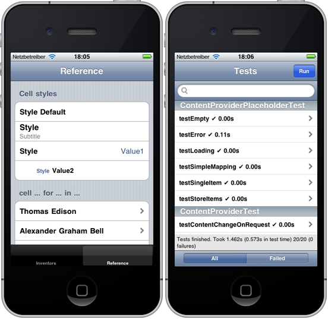
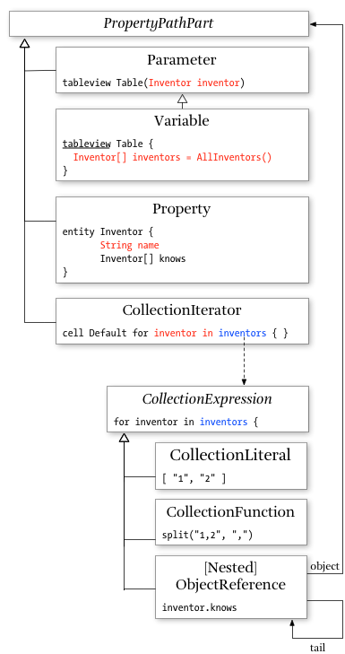

[Source](https://github.com/ralfebert/applitude/) |
[Issues](http://ralfebert.lighthouseapp.com/projects/67904/) |
[Downloads](#downloads)

# 

applitude is a runtime framework and a domain-specific language for iPhone application development. It is an extended, iPhone-only version of the [Applause](http://code.google.com/p/applause/) project.

## Overview

applitude comes with a DSL to describe common functionality of iPhone applications in a crisp and precise way. For example, this application loads [JSON data](https://github.com/ralfebert/applitude/blob/gh-pages/demo/devices.json) from an URL:

This application was generated from [`demo.app`](https://github.com/ralfebert/applitude/blob/master/examples/demo/demo.app):

	entity Inventor {
		String name
		String imageUrl
		Invention[] inventions
	}

	entity Invention {
		String name
	}

	contentprovider AllInventors returns Inventor[] fetches JSON from
		"http://ralfebert.github.com/applitude/demo/inventors.json" selects ""

	tableview Inventors {
		Inventor[] inventors = AllInventors()

		title: "Inventors"

		section {
			cell Default for inventor in inventors {
				text: inventor.name
				image: inventor.imageUrl
				action: InventorDetail(inventor)
			}
		}
	}

	tableview InventorDetail(Inventor inventor) {
		title: inventor.name
		style: Grouped

		section {
			cell Value2 {
				text: "Name"
				details: inventor.name
			}
		}

		section {
			title: "Inventions"
			cell Default for invention in inventor.inventions {
				text: invention.name
			}
		}
	}

applitude is based on the [Xtext language development framework](http://www.eclipse.org/Xtext/), and as such, it comes with an Eclipse IDE plug-in:

There is a code generator which writes Objectice C code from such `.app` documents. The generated code is kept small and tidied up by making use of runtime components wherever possible. Have a look at [examples/demo/Generated](https://github.com/ralfebert/applitude/tree/master/examples/demo/Generated) to see the kind of code generated for applitude apps.

## Target audience

The project is work in progress. In its current form it is only applicable if you have very good knowledge of iPhone development with Objective C and building DSLs with Eclipse Xtext.

## Getting started

* At first, learn about building DSLs with Xtext, for example by following the tutorial in the [Xtext Getting started documentation](http://www.eclipse.org/Xtext/documentation/).
* I wrote a tutorial for the original Applause project which shows [how to install everything and create a project from scratch](http://www.ralfebert.de/blog/xtext/applause_new_app/). Almost everything still holds true for applitude.
* Import the example projects in Eclipse, inspect the `*.app` documents, run the projects from Xcode, inspect the generated code.

## Demo Example project

[`examples/demo/`](https://github.com/ralfebert/applitude/tree/master/examples/demo) contains the Inventors example which fetches JSON content via HTTP and shows it using table views:

It also contains a reference part showing the language features and the [GHUnit](https://github.com/gabriel/gh-unit/) test suite (target Tests):

## Downloads

You can download the project in either:

  
  

You can also clone the project with [Git](http://git-scm.com) by running:

	$ git clone git://github.com/ralfebert/applitude

Or get the source code on the [GitHub project page](http://github.com/ralfebert/applitude)

## Appendix

### Expression Model Objects

## Licenses

applitude is licensed under the [Eclipse Public License v1.0](http://www.eclipse.org/legal/epl-v10.html).

Some runtime components have differenter licenses:

* ASIHTTPRequest, TouchXML, Reachability, parts of NSDate+Utils: BSD license
* TouchJSON, GHUnit, TextFieldCell: MIT license
* TTGlobalNetwork, UIView+Coordinates, parts of URLUtils: Apache License
* UIImage+Alpha/Resize/RoundedCorner: Other licenses

This document is licensed under 
